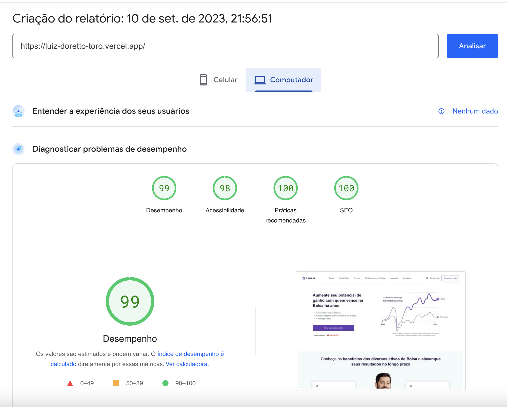
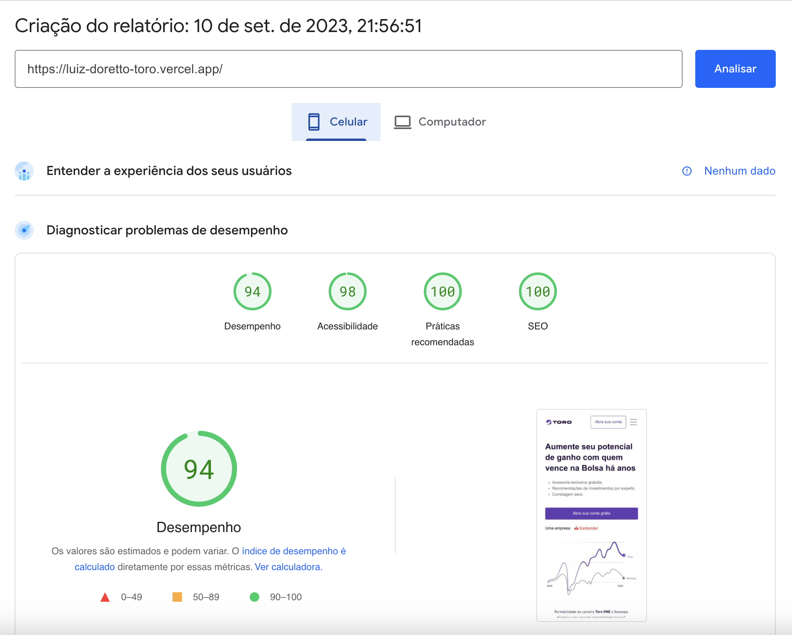

## Getting Started

First, install all dependencies:

```bash
npm install
```

After, install husky dependencies:

```bash
num run prepare
```

Finaly, run the development server:

```bash
num run dev
```

## Project Structure

### ESLint and Prettier

Used to check sintax, find problems and enforce code style.

### Husky, commitlint and commitzen

Used to follow convencional commits, a commit pattern.

### Tailwind, tailwind-variants and framer-motion

Used to make some animations in a easy way (framer-motion), to use css directly on markup (tailwind) and to organize it better (tv).

### Jest and React Testing Library

Used to create tests.

## Performance and Responsiveness

One of the main focus of the project was the performance, with that in mind one important step was to import bigger images as webp. Another great step was to use `Image` component from `next/image`, that component allow us to use a blur placeholder while the image is being loaded and also load the image using the lazy loading, by default. This combination results in a performance like the images below, from the PageSpeed Insights website:





## Deploy and Actions

You can visit the deploy on [this link](luiz-doretto-toro.vercel.app), also included in the project about section.

You can also check the actions on the Action tab, this action was just to ensure that any test will not fail while creating a new PR.
